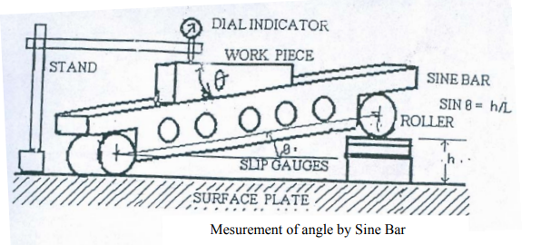

## Procedure

**Schematic of the Plant**

            

**Steps to perform the simuation**

1. The experiment began with selecting the surface plate as the datum surface.

2. The component, whose angle required evaluation, was securely affixed to the sine bar, and both were positioned on the surface plate.

3. The sine bar and the component were positioned at an approximate angle by introducing a known-size slip gauge at one end of the sine bar, aligning the tapered side of the component with the surface plate. The complete contact between the slip gauge was done by wringing. Wringing is done by hand by sliding and twisting motions.  One gauge is placed perpendicular to the other using standard gauging pressure, and then a rotary motion is applied until the blocks are lined up.  In this way air is expelled from between the gauge faces, causing the blocks to adhere.

4. A dial gauge, affixed to a suitable stand, was situated adjacent to the sine bar to ensure the plunger glided smoothly along the component's surface. The dial gauge was calibrated to zero at one end.

5. The same dial gauge was moved over its surface from one end to another and the deflection reading was recorded. The height of the slip gauges beneath the one end of sine bar was adjusted until the dial gauge indicated zero deflection over the entire workpiece surface. 

6. The taper angle of the component was subsequently determined using the prescribed formula.

  